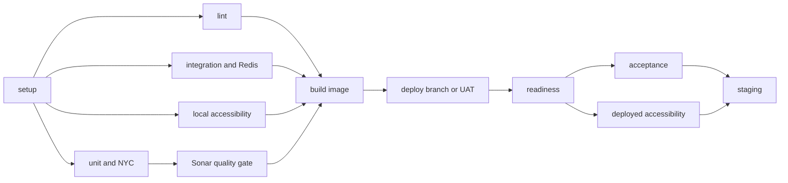

# HOFF-2259 Test Coverage Implementation Plan

## Phase 1: Stabilise Unit Testing

1. Standardise intended unit suites on the `.spec.js` filename convention.
2. Repair stale Proxyquire paths and malformed fixtures exposed by complete discovery.
3. Run lint and the complete unit suite under Node 24.
4. Configure NYC with `all: true` and an explicit `apps/**/*.js` include.
5. Review broad field and section exclusions so executable validators and parsers are measured.
6. Measure the honest all-source baseline and commit integer-floor thresholds.
7. Add focused external-boundary tests for authentication, iCasework, Notify, StatsD, PDF conversion, and file-vault behavior.
8. Apply test-led production fixes and ratchet thresholds upward.

## Phase 2: Add Integration Testing

1. Add Supertest and a `test:integration` package script.
2. Create a Mocha integration harness that starts the real application on a dedicated port with `NODE_ENV=ci`.
3. Connect the application to Drone's Redis `session` service.
4. Add a bounded readiness helper for `/healthz/readiness` and reliable process cleanup.
5. Cover health endpoints, entry redirects, rendering, validation, route forks, Redis session retention and isolation, and deterministic mock API contracts.
6. Add JUnit reporting and useful application logs.
7. Add a blocking `integration_tests` Drone job before image construction.

## Phase 3: Repair and Gate Acceptance Testing

1. Move all Cucumber hooks to module scope and maintain one browser context per scenario.
2. Remove mock-fs and cross-process Sinon stubs from browser steps.
3. Add committed upload fixtures and deterministic mock responses.
4. Add CI contract stubs for PDF conversion, file vault, Keycloak, iCasework, and Notify workflows required by submission scenarios.
5. Replace the Alpine acceptance runner with a Node 24 Playwright-compatible image and pin the browser version to the lockfile.
6. Capture Cucumber JUnit, screenshots, traces, console output, and network diagnostics.
7. Classify scenarios with smoke, regression, upload, submission, and destructive tags.
8. Run smoke scenarios after pull-request deployment and full non-destructive regression after master UAT deployment.

## Phase 4: Add Accessibility Testing

1. Add `@axe-core/playwright` and a `test:accessibility` script.
2. Scan representative static, journey, validation, conditional, upload, check-answers, declaration, and confirmation states.
3. Fail on WCAG 2.0 and 2.1 level A and AA axe violations.
4. Add explicit keyboard, focus, error-summary, title, heading, landmark, and navigation-focus checks.
5. Produce machine-readable axe output and failure traces/screenshots.
6. Run stable local accessibility checks before image construction.
7. Run deployed smoke checks on pull requests and full non-destructive checks on master.

## Phase 5: Enforce Drone and Sonar Gates

1. Make Sonar depend on unit coverage generation.
2. Configure Sonar to wait for its quality gate with a bounded timeout.
3. Make image construction depend on lint, unit, integration, local accessibility, and Sonar.
4. Correct branch/event rules so feature and pull-request deployments have an image to consume.
5. Add readiness and browser smoke gates after branch deployment.
6. Add full browser regression gates after master UAT deployment.
7. Make staging depend on successful master acceptance and accessibility jobs.
8. Align NYC and Sonar source/test scope and justified exclusions.
9. Update README commands, prerequisites, test tags, artifact locations, and coverage-ratchet policy.

## Planned Pipeline

## Delivery Order

Implement and validate one layer at a time:

1. Unit discovery and honest coverage.
2. Integration harness and Drone gate.
3. Acceptance repair and deterministic service stubs.
4. Accessibility harness.
5. Post-deployment Drone topology and documentation.
